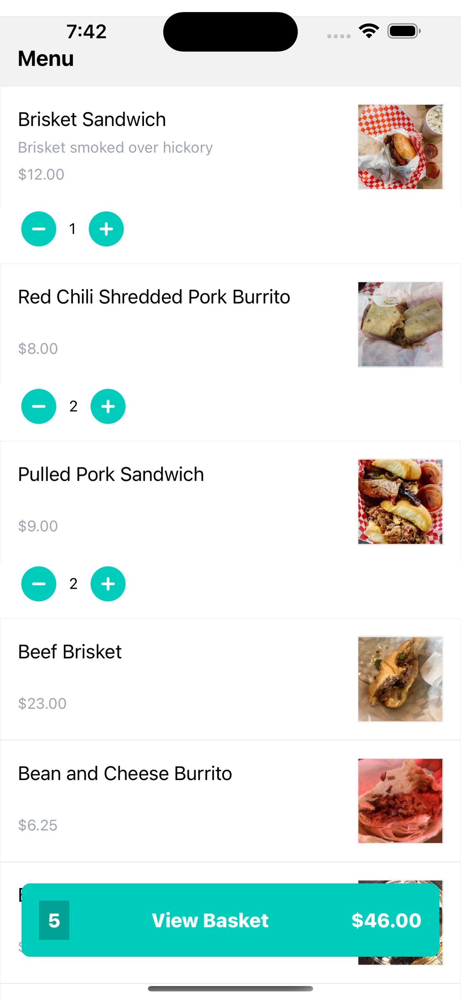

# Deliveroo Clone

iOS/Android React Native project of [Deliveroo](https://deliveroo.co.uk/). Built using REACT NATIVE with (Navigation, Redux, Tailwind CSS & Sanity.io)

## How to Run

### Install Dependencies

`npm i`

### Start it up

`npx expo start`

## How to Deploy Changes to Expo

### Optimize assets

`npx expo-optimize`

## Publish to Expo

`eas update`

### Build for Android and/or iOS

`eas build`

#### To create a Development Build

`eas build --profile development`

### Submit to the App store and Google Play store

`eas submit`

## Screenshots

&nbsp; &nbsp; &nbsp; &nbsp;&nbsp; &nbsp; &nbsp; &nbsp;

&nbsp; &nbsp; &nbsp; &nbsp;&nbsp; &nbsp; &nbsp; &nbsp;

## References

- https://www.youtube.com/watch?v=taPz40VmyzQ
- https://www.sanity.io/sonny
